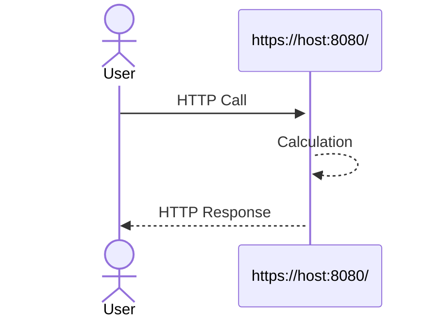
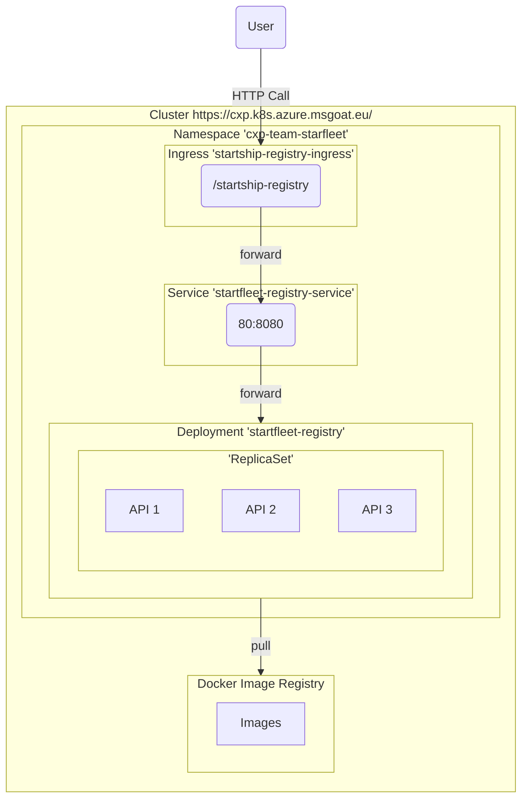

# msg CXP - Team Starfleet

## Specification

### API



### Kubernetes Cluster



## Implementations

### C#

```bash
export DOCKER_IMAGE=docker.cloudtrain.aws.msgoat.eu/cxp/starfleet/registry-number:1.0.0-csharp
docker build -t $DOCKER_IMAGE -f api-csharp/Dockerfile api-csharp
docker push $DOCKER_IMAGE
```

### TypeScript

```bash
export DOCKER_IMAGE=docker.cloudtrain.aws.msgoat.eu/cxp/starfleet/registry-number:1.0.0-typescript
docker build -t $DOCKER_IMAGE -f api-typescript/Dockerfile api-typescript
docker push $DOCKER_IMAGE
```
